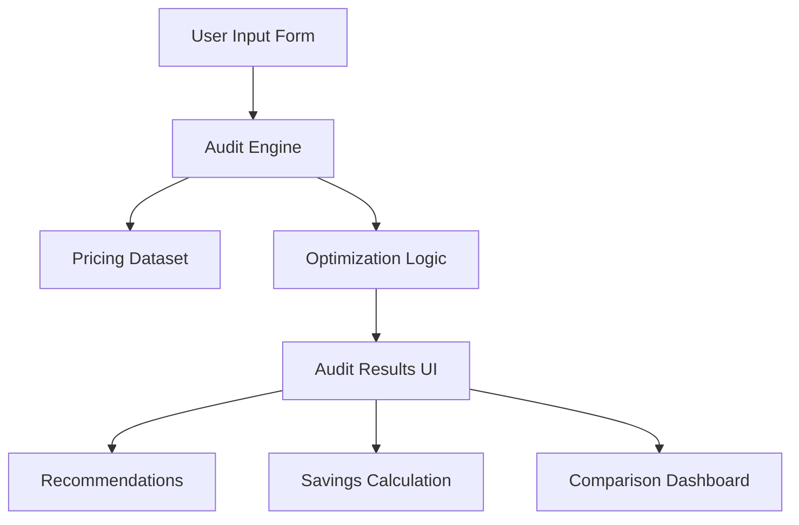

# ARCHITECTURE.md

## System Overview

SpendPilot is a lightweight AI spend optimization platform built using Next.js, TypeScript, and Tailwind CSS.

The platform analyzes a user's AI tooling stack and identifies opportunities to reduce unnecessary spending through pricing optimization and plan consolidation.

---

# Architecture Diagram

---

# Data Flow

1. User enters:

   * AI tool
   * Current plan
   * Monthly spend
   * Team size

2. Form state is persisted locally using browser localStorage.

3. Submitted data is passed into the audit engine.

4. The audit engine compares:

   * current spend
   * team size
   * plan usage
   * vendor pricing

5. Optimization recommendations are generated.

6. Results are rendered instantly on screen.

---

# Stack Decisions

## Next.js

Chosen for:

* App Router support
* fast deployment on Vercel
* server/client rendering flexibility
* production-grade routing

## TypeScript

Chosen for:

* safer financial calculations
* predictable data structures
* scalable maintainability

## Tailwind CSS

Chosen for:

* rapid UI iteration
* utility-first responsive design
* lightweight styling workflow

## Framer Motion

Used for:

* smoother audit transitions
* better perceived responsiveness

---

# Scaling to 10k Audits Per Day

If SpendPilot needed to support large-scale traffic:

* move pricing logic into dedicated services
* cache audit calculations
* use PostgreSQL instead of local state
* add queue-based analytics processing
* implement rate limiting and abuse detection
* add CDN edge caching for static pages

---

# Tradeoffs

* Hardcoded audit rules were preferred over AI-generated calculations to ensure pricing transparency and deterministic outputs.
* Backend persistence was intentionally deferred during the MVP stage to prioritize shipping the audit experience quickly.
