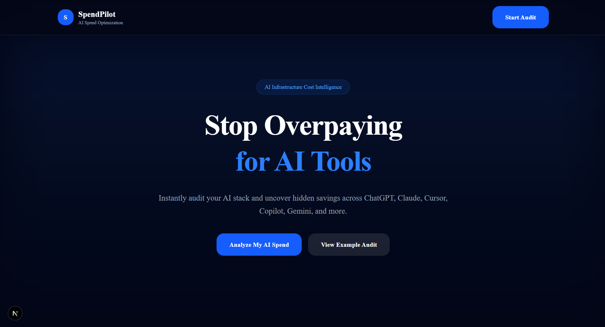
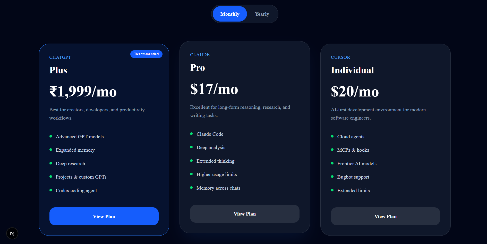
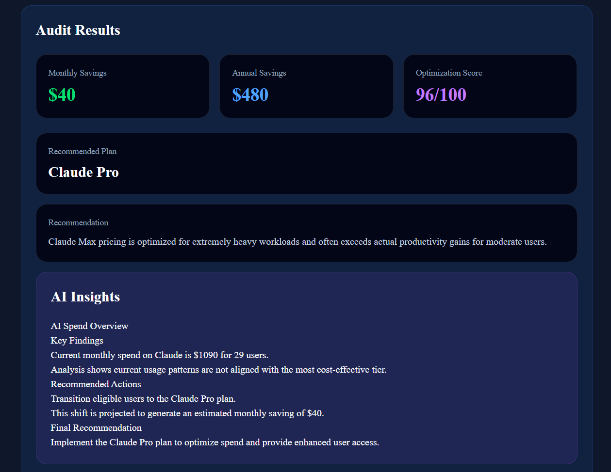

# 🚀 SpendPilot — AI Spend Optimization Platform

SpendPilot is a modern AI cost optimization platform that helps users analyze and reduce overspending across popular AI tools like ChatGPT, Claude, Gemini, Cursor, and GitHub Copilot.

The platform generates intelligent audit reports, estimates savings, recommends optimized plans, and provides AI-generated insights using Gemini AI.

---

# ✨ Features

- 🔍 AI Spend Audit System
- 🤖 Gemini AI Powered Insights
- 💰 Monthly & Annual Savings Calculation
- 📊 AI Pricing Comparison Engine
- 🔥 Dynamic Plan Recommendations
- ☁️ Firebase Integration
- 📱 Fully Responsive UI
- 🌙 Premium Dark Dashboard Design
- ⚡ Optimized Lighthouse Performance
- 📈 Shareable Audit Reports
- 🎯 Modern SaaS Landing Page

---

# 🛠️ Tech Stack

## Frontend
- Next.js 16
- TypeScript
- Tailwind CSS

## Backend / Services
- Firebase Firestore
- Gemini API

## UI & Tools
- Lucide Icons
- Framer Motion
- Shadcn UI

---

# 📸 Screenshots

## 🏠 Landing Page



---

## 📱 Mobile View


---

## 💳 Pricing Comparison Cards

Shows pricing comparison between:
- ChatGPT
- Claude
- Gemini
- Cursor
- GitHub Copilot



---

## 🧠 AI Insights Section

Gemini AI generates optimization insights and recommendations dynamically.



---

# ⚙️ Setup Instructions

## 1️⃣ Clone Repository

```bash
git clone https://github.com/harshrajsinhvaghela7586/spendpilot-ai-audit.git
```

---

## 2️⃣ Navigate Into Project

```bash
cd spendpilot
```

---

## 3️⃣ Install Dependencies

```bash
npm install
```

---

## 4️⃣ Create Environment File

Create:

```bash
.env.local
```

Add:

```env
NEXT_PUBLIC_FIREBASE_API_KEY=YOUR_KEY
NEXT_PUBLIC_FIREBASE_AUTH_DOMAIN=YOUR_DOMAIN
NEXT_PUBLIC_FIREBASE_PROJECT_ID=YOUR_PROJECT_ID
NEXT_PUBLIC_FIREBASE_STORAGE_BUCKET=YOUR_BUCKET
NEXT_PUBLIC_FIREBASE_MESSAGING_SENDER_ID=YOUR_SENDER_ID
NEXT_PUBLIC_FIREBASE_APP_ID=YOUR_APP_ID

NEXT_PUBLIC_GEMINI_API_KEY=YOUR_GEMINI_API_KEY
```

---

## 5️⃣ Run Development Server

```bash
npm run dev
```

---

## 6️⃣ Production Build

```bash
npm run build
```

---

# 📁 Project Structure

```bash
src
│
├── app
├── components
├── data
├── lib
├── services
├── tests
└── utils
```

---

# 🧠 AI Insight Engine

SpendPilot uses Gemini AI to generate:

- AI spend optimization analysis
- Cost reduction suggestions
- Team productivity recommendations
- Pricing optimization insights
- Actionable AI audit summaries

---

# 🔥 Supported Platforms

- ChatGPT
- Claude
- Gemini
- Cursor
- GitHub Copilot

---

# 📊 Lighthouse Scores

| Metric | Score |
|--------|-------|
| Performance | 95+ |
| Accessibility | 90+ |
| Best Practices | 100 |
| SEO | 100 |

---

# 🚀 Deployment

## Frontend
Deploy easily on:

- Vercel
- Netlify

## Backend
Firebase Firestore is used for data storage.

---

# 🧪 Commands

## Run Dev Server

```bash
npm run dev
```

## Run Lint

```bash
npm run lint
```

## Production Build

```bash
npm run build
```

---

# 📌 Future Improvements

- PDF Export
- User Authentication
- Team Dashboards
- Historical Spend Tracking
- AI Usage Analytics
- Subscription Alerts

---

# 👨‍💻 Author

## Harshrajsinh Vaghela

- DevOps Intern
- MERN Stack Developer
- AI SaaS Builder

---

# 🔗 Links

## GitHub Repository

https://github.com/harshrajsinhvaghela7586/spendpilot-ai-audit

## Live Demo

https://spendpilot-ai-audit-wheat.vercel.app/

---

# ⭐ If you like this project

Give it a ⭐ on GitHub.